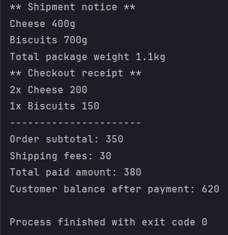

# Fawry Internship Full Stack Development Task

This is a simple Java task for a Full Stack Development internship, simulating an e-commerce checkout system.

## Features:
- Product management (expiry, shipping, weight).
- Customer balance.
- Shopping cart.
- Checkout with stock/expiry/balance checks.
- Shipping service.

## Console Output Example:
